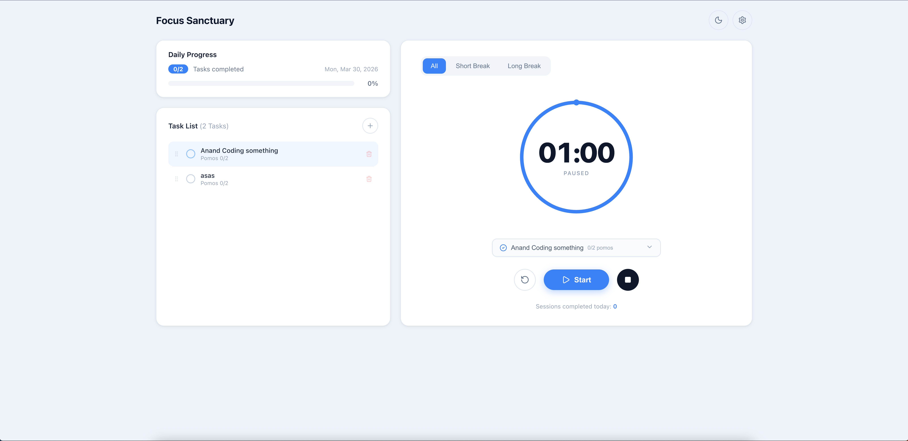
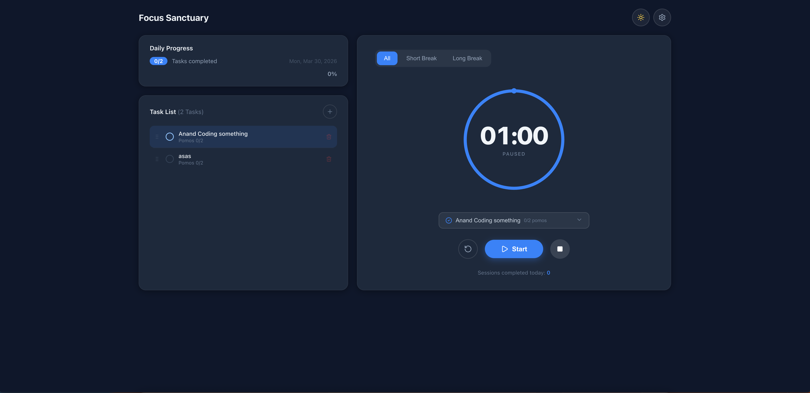

# Focus Sanctuary

A clean, minimal Pomodoro timer. **Free forever. No ads. No accounts. No tracking.**

Built because every other Pomodoro app on the internet is either bloated, paywalled, or plastered with ads. This one isn't. Use it, share it, fork it.

---

## Screenshots

**Light Mode**


**Dark Mode**


---

## Features

- **Circular ring timer** with a depleting arc and animated tip dot
- **Focus / Short Break / Long Break** modes (25 / 5 / 15 min by default)
- **Task list** — add tasks with a target pomo count, track completed pomos per task, drag to reorder
- **Task picker on the timer** — select what you're working on and pomos are credited automatically
- **Daily progress bar** — see how many tasks you've knocked out today
- **Settings** — customize all durations and sessions-before-long-break; optional auto-start
- **Light & dark mode** — follows your preference, toggle anytime
- **Gentle chime** on session complete (Web Audio API, no files)
- **Fully responsive** — timer-first layout on mobile with a slide-up task drawer
- Everything persists in `localStorage` — no server, no account

---

## Running locally

```bash
npm install
npm run dev
```

Requires Node 18+. Built with React + Vite.

---

## Stack

- [React](https://react.dev) + [Vite](https://vitejs.dev)
- [Framer Motion](https://www.framer.com/motion/) — animations & drag-to-reorder
- [Lucide React](https://lucide.dev) — icons
- [Tailwind CSS v4](https://tailwindcss.com)

---

## License

MIT — do whatever you want with it.
